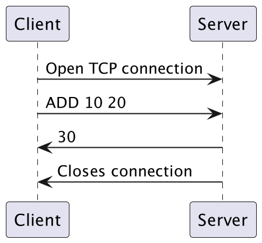
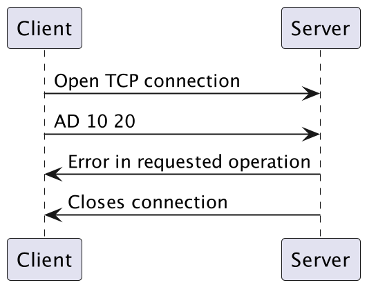

# Section 1: Overview
Remote calculator is client-server protocol. The client send a binary operation to the server . 
Server compute results and send it back to the client.
If the message format isn't respected then the server send a error message.

# Section 2: Transport Layer Protocol
Remote calculator use TCP to communicate. The client establish a connection. 
It has to know the IP address of the server. The server listen to port 53474 .
The server closes the connection when the requested file or error message has been sent

# Section 3: Messages
- **\<Operator>  \<Operand1>  \Operand2>**

  The client request the result of this operation. Operator would be the desired operation in english. 

  
Supported operation are:
- ADD for addition
- SUB for subtraction
- MUL for multiplication
- DIV for division
  
Operand 1 and 2 follow the following rules:
  - They should only be integers 
  - All Leading zeroes should be ignored. Example: 0029 = 29
  - If floating point number is entered, the resulting 
  operand will be rounded to the nearest integer

- **Error in requested operation**
    
    - Error response if the server cannot parse the requested operation
    - All messages are encoded in UTF-8 with an '\n' at the end
    - If the server receive more than 2 operands the server respond with an error
  
    The server send the result of the operation.

# Section 4:
### Successful connection:

### Unsuccessful connection:

